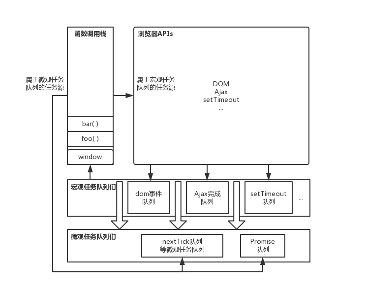

# JavaScript数据结构与算法

## 栈
:::tip
栈的场景
:::

### 1、什么是栈？
* 栈是一个后进先出的数据结构
* javascript 中没有栈，但可以用Array实现栈的所有功能
* 栈常用操作：push、pop、stack[stack.length - 1]
* 特性：后进先出

### 2、函数调用堆栈
理解函数的调用顺序

## 队列
:::tip
* 生活场景：食堂打饭。
* code：Event Loop
:::

### 1、队列是什么？
* 一个先进先出的数据结构，并有序的。
* javascript 中没有队列，但可以用Array实现队列的所有功能
* js是单线程，无法同时处理异步中的并发任务
* 使用任务队列先后处理异步任务
* 特性：先进先出 

```js
const queue = [];
queue.push(1); // 入列
queue.push(2); // 入列
const item1 = queue.shift(); // 出列  item1 = 1
const item2 = queue.shift(); // 出列  item2 = 2
```

### 2、异步队列
```js
setTimeout(() => console.log(1), 0);
console.log(2);
```
**事件循环与任务队列**：

1. 一段js代码刚执行的时候，会有一个主事件，因为js引擎是单线程的
2. 可以用如下图表示



