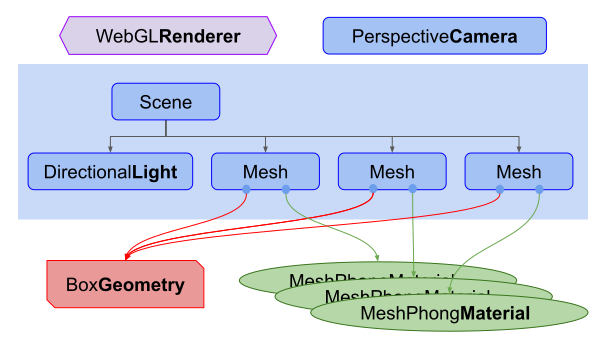

# Three.js

## 什么是 web 三维

Three.js 经常会和 WebGL 混淆， 但也并不总是，three.js 其实是使用 WebGL 来绘制三维效果的。 WebGL 是一个只能画点、线和三角形的非常底层的系统. 想要用 WebGL 来做一些实用的东西通常需要大量的代码， 这就是 Three.js 的用武之地。它封装了诸如场景、灯光、阴影、材质、贴图、空间运算等一系列功能，让你不必要再从底层 WebGL 开始写起。

## 基本组成

人们在学习大多数编程语言的时候第一件事就是让电脑打印个"Hello World!"。 对于三维来说第一件事往往是创建一个三维的立方体。 所以我们从"Hello Cube!"开始。

在我们开始前，让我们试着让你了解一下一个 three.js 应用的整体结构。一个 three.js 应用需要创建很多对象，并且将他们关联在一起。下图是一个基础的 three.js 应用结构。


#### 上图需要注意的事项

- 首先有一个渲染器(Renderer)。这可以说是 three.js 的主要对象。你传入一个场景(Scene)和一个摄像机(Camera)到渲染器(Renderer)中，然后它会将摄像机视椎体中的三维场景渲染成一个二维图片显示在画布上。

- 其次有一个场景图 它是一个树状结构，由很多对象组成，比如图中包含了一个场景(Scene)对象 ，多个网格(Mesh)对象，光源(Light)对象，群组(Group)，三维物体(Object3D)，和摄像机(Camera)对象。一个场景(Scene)对象定义了场景图最基本的要素，并包了含背景色和雾等属性。这些对象通过一个层级关系明确的树状结构来展示出各自的位置和方向。子对象的位置和方向总是相对于父对象而言的。比如说汽车的轮子是汽车的子对象，这样移动和定位汽车时就会自动移动轮子。你可以在场景图的这篇文章中了解更多内容。

  注意图中摄像机(Camera)是一半在场景图中，一半在场景图外的。这表示在 three.js 中，摄像机(Camera)和其他对象不同的是，它不一定要在场景图中才能起作用。相同的是，摄像机(Camera)作为其他对象的子对象，同样会继承它父对象的位置和朝向。在场景图这篇文章的结尾部分有放置多个摄像机(Camera)在一个场景中的例子。

- 网格(Mesh)对象可以理解为用一种特定的材质(Material)来绘制的一个特定的几何体(Geometry)。材质(Material)和几何体(Geometry)可以被多个网格(Mesh)对象使用。比如在不同的位置画两个蓝色立方体，我们会需要两个网格(Mesh)对象来代表每一个立方体的位置和方向。但只需一个几何体(Geometry)来存放立方体的顶点数据，和一种材质(Material)来定义立方体的颜色为蓝色就可以了。两个网格(Mesh)对象都引用了相同的几何体(Geometry)和材质(Material)。

- 几何体(Geometry)对象顾名思义代表一些几何体，如球体、立方体、平面、狗、猫、人、树、建筑等物体的顶点信息。Three.js 内置了许多基本几何体 。你也可以创建自定义几何体或从文件中加载几何体。

- 材质(Material)对象代表绘制几何体的表面属性，包括使用的颜色，和光亮程度。一个材质(Material)可以引用一个或多个纹理(Texture)，这些纹理可以用来，打个比方，将图像包裹到几何体的表面。

- 纹理(Texture)对象通常表示一幅要么从文件中加载，要么在画布上生成，要么由另一个场景渲染出的图像。

- 光源(Light)对象代表不同种类的光。

#### 有了以上基本概念，我们接下来就来画个下图所示的"Hello Cube"吧


首先是加载 three.js

```js
<script type="module">
  import * as THREE from 'three';
</script>
```

下一步我们需要一个 `<canvas>` 标签。

```html
<body>
  <canvas id="view"></canvas>
</body>
```

Three.js需要使用这个canvas标签来绘制，所以我们要先获取它然后传给three.js。

```js
<script type="module">
import * as THREE from 'three';
 
function main() {
  const canvas = document.querySelector('#c');
  const renderer = new THREE.WebGLRenderer({canvas});
  ...
</script>
```

拿到canvas后我们需要创建一个WebGL渲染器(WebGLRenderer)。渲染器负责将你提供的所有数据渲染绘制到canvas上。之前还有其他渲染器，比如CSS渲染器(CSSRenderer)、Canvas渲染器(CanvasRenderer)。将来也可能会有WebGL2渲染器(WebGL2Renderer)或WebGPU渲染器(WebGPURenderer)。目前的话是WebGL渲染器(WebGLRenderer)，它通过WebGL将三维空间渲染到canvas上。

注意这里有一些细节。如果你没有给three.js传canvas，three.js会自己创建一个 ，但是你必须手动把它添加到文档中。在哪里添加可能会不一样这取决你怎么使用， 我发现给three.js传一个canvas会更灵活一些。我可以将canvas放到任何地方， 代码都会找到它，假如我有一段代码是将canvas插入到文档中，那么当需求变化时， 我很可能必须去修改这段代码。

接下来我们需要一个透视摄像机(PerspectiveCamera)。

```js
const fov = 75;    // 相机平截头体垂直视野。
const aspect = 2;  // 相机平截头体纵横比。
const near = 0.1;  // 平面附近的相机平截头体。
const far = 5;     // 相机平截头体远平面。
const camera = new THREE.PerspectiveCamera(fov, aspect, near, far);
```

fov是视野范围(field of view)的缩写。上述代码中是指垂直方向为75度。 注意three.js中大多数的角用弧度表示，但是因为某些原因透视摄像机使用角度表示。

aspect指画布的宽高比。我们将在别的文章详细讨论，在默认情况下 画布是300x150像素，所以宽高比为300/150或者说2。

near和far代表近平面和远平面，它们限制了摄像机面朝方向的可绘区域。 任何距离小于或超过这个范围的物体都将被裁剪掉(不绘制)。

这四个参数定义了一个 "视椎(frustum)"。 视椎(frustum)是指一个像被削去顶部的金字塔形状。换句话说，可以把"视椎(frustum)"想象成其他三维形状如球体、立方体、棱柱体、截椎体。

如下图表示：


近平面和远平面的高度由视野范围决定，宽度由视野范围和宽高比决定。

视椎体内部的物体将被绘制，视椎体外的东西将不会被绘制。

摄像机默认指向Z轴负方向，上方向朝向Y轴正方向。我们将会把立方体放置在坐标原点，所以我们需要往后移一下摄像机才能显示出物体。

```js
camera.position.z = 2;
```

下图是我们想要达到的效果。


我们能看到摄像机的位置在z = 2。它朝向Z轴负方向。我们的视椎体范围从摄像机前方0.1到5。因为这张图是俯视图，视野范围会受到宽高比的影响。画布的宽度是高度的两倍，所以水平视角会比我们设置的垂直视角75度要大。

然后我们创建一个场景(Scene)。场景(Scene)是three.js的基本的组成部分。需要three.js绘制的东西都需要加入到scene中。 我们将会在场景是如何工作的一文中详细讨论。

```js
const scene = new THREE.Scene();
```

然后创建一个包含盒子信息的立方几何体(BoxGeometry)。几乎所有希望在three.js中显示的物体都需要一个包含了组成三维物体的顶点信息的几何体。

```js
const boxWidth = 1;
const boxHeight = 1;
const boxDepth = 1;
const geometry = new THREE.BoxGeometry(boxWidth, boxHeight, boxDepth);
```

然后创建一个基本的材质并设置它的颜色. 颜色的值可以用css方式和十六进制来表示。

```js
const material = new THREE.MeshBasicMaterial({color: 0x44aa88});
```

再创建一个网格(Mesh)对象，它包含了：

#### 1. 几何体(Geometry)(物体的形状)

#### 2. 材质(Material)(如何绘制物体，光滑还是平整，什么颜色，什么贴图等等)

#### 3. 对象在场景中相对于他父对象的位置、朝向、和缩放。下面的代码中父对象即为场景对象

```js
const cube = new THREE.Mesh(geometry, material);
```

最后我们将网格添加到场景中。

```js
scene.add(cube);
```

之后将场景和摄像机传递给渲染器来渲染出整个场景。

```js
renderer.render(scene, camera);
```

这里有一个实例。  
<Basic-test/>

很难看出来这是一个三维的立方体，因为我们直视Z轴的负方向并且立方体和坐标轴是对齐的，所以我们只能看到一个面。

我们来让立方体旋转起来，以便更好的在三维环境中显示。为了让它动起来我们需要用到一个渲染循环函数 requestAnimationFrame.

代码如下：  

```js
function render(time) {
  time *= 0.001;  // 将时间单位变为秒
 
  cube.rotation.x = time;
  cube.rotation.y = time;
 
  renderer.render(scene, camera);
 
  requestAnimationFrame(render);
}
requestAnimationFrame(render);
```

<Basic-test-1 />

效果好了一些但还是很难看出是三维的。我们来添加些光照效果，应该会有点帮助。three.js中有很多种类型的灯光，我们将在后期文章中详细讨论。现在我们先创建一盏平行光。

```js
{
  const color = 0xFFFFFF;
  const intensity = 1;
  const light = new THREE.DirectionalLight(color, intensity);
  light.position.set(-1, 2, 4);
  scene.add(light);
}
```

平行光有一个位置和目标点。默认值都为(0, 0, 0)。我们这里 将灯光的位置设为(-1, 2, 4)，让它位于摄像机前面稍微左上方一点的地方。目标点还是(0, 0, 0)，让它朝向坐标原点方向。

我们还需要改变下立方体的材质。MeshBasicMaterial材质不会受到灯光的影响。我们将他改成会受灯光影响的MeshPhongMaterial材质。

```js
const material = new THREE.MeshPhongMaterial({color: 0x44aa88}); 
```

这是我们新的项目结构
  
新的效果：  
<Basic-test-2 />

现在应该可以很清楚的看出是三维立方体了。  

我们再添加两个立方体。

每个立方体会引用同一个几何体和不同的材质，这样每个立方体将会是不同的颜色。

首先我们创建一个根据指定的颜色生成新材质的函数。它会根据指定的几何体生成对应网格，然后将网格添加进场景并设置其X轴的位置。

```js
function makeInstance(geometry, color, x) {
  const material = new THREE.MeshPhongMaterial({color});
 
  const cube = new THREE.Mesh(geometry, material);
  scene.add(cube);
 
  cube.position.x = x;
 
  return cube;
}
```

然后我们将用三种不同的颜色和X轴位置调用三次函数，将生成的网格实例存在一个数组中。

```js
const cubes = [
  makeInstance(geometry, 0x44aa88,  0),
  makeInstance(geometry, 0x8844aa, -2),
  makeInstance(geometry, 0xaa8844,  2),
];
```

最后我们将在渲染函数中旋转三个立方体。我们给每个立方体设置了稍微不同的旋转角度。

```js
function render(time) {
  time *= 0.001 // convert time to seconds

  cubes.forEach((cube, ndx) => {
    const speed = 1 + ndx * 0.1
    const rot = time * speed
    cube.rotation.x = rot
    cube.rotation.y = rot
  })

  renderer.render(scene, camera)

  requestAnimationFrame((e) => {
    this.render(e)
  })
}
```

最终效果：  
<Basic-test-3 />

如果你对比上面的示意图可以看到此效果符合我们的预想。位置为X = -2 和 X = +2的立方体有一部分在我们的视椎体外面。他们大部分是被包裹的，因为水平方向的视角非常大。

我们的项目现在有了这样的结构


正如所见的那样，我们有三个网格(Mesh)引用了相同的立方几何体(BoxGeometry)。每个网格(Mesh)引用了一个单独的MeshPhongMaterial材质来显示不同的颜色。

## 图元  

Three.js 有很多图元。图元就是一些 3D 的形状，在运行时根据大量参数生成。

使用图元是种很常见的做法，像使用球体作为地球，或者使用大量盒子来绘制 3D 图形。 尤其是用来试验或者刚开始学习 3D。 对大多数 3D 应用来说，更常见的做法是让美术在 3D 建模软件中创建 3D 模型， 像 Blender，Maya 或者 Cinema 4D。 之后在这个系列中，我们会涵盖到创建和加载来自 3D 建模软件的模型。 现在，让我们仅使用可以获得的图元。

下面的很多图元都有默认的部分或者全部参数，仅供参考使用。

### BoxGeometry 盒子  

[THREE.BoxGeometry](https://threejs.org/docs/index.html#api/en/geometries/BoxGeometry)

<Primitive-box-geometry />

```js
const width = 8;  // ui: width
const height = 8;  // ui: height
const depth = 8;  // ui: depth
const geometry = new THREE.BoxGeometry(width, height, depth);
```

<Primitive-box-geometry-segments />

```js
const width = 8;  // ui: width
const height = 8;  // ui: height
const depth = 8;  // ui: depth
const widthSegments = 4;  // ui: widthSegments
const heightSegments = 4;  // ui: heightSegments
const depthSegments = 4;  // ui: depthSegments
const geometry = new THREE.BoxGeometry(width, height, depth, widthSegments, heightSegments,depthSegments);
```

### CircleGeometry 平面圆  

[THREE.CircleGeometry](https://threejs.org/docs/index.html#api/en/geometries/CircleGeometry)

<Primitive-circle-geometry />

```js
const radius = 7;  // ui: radius
const segments = 24;  // ui: segments
const geometry = new THREE.CircleGeometry(radius, segments);
```

<Primitive-circle-geometry-segments />

```js
const radius = 7;  // ui: radius
const segments = 24;  // ui: segments
const thetaStart = Math.PI * 0.25;  // ui: thetaStart
const thetaLength = Math.PI * 1.5;  // ui: thetaLength
const geometry = new THREE.CircleGeometry(radius, segments, thetaStart, thetaLength);
```

### ConeGeometry 锥形

[THREE.ConeGeometry](https://threejs.org/docs/index.html#api/en/geometries/ConeGeometry)

<Primitive-cone-geometry />
```js
const radius = 6;  // ui: radius
const height = 8;  // ui: height
const radialSegments = 16;  // ui: radialSegments
const geometry = new THREE.ConeGeometry(radius, height, radialSegments);
```

<Primitive-cone-geometry-segments />
```js
const radius = 6;  // ui: radius
const height = 8;  // ui: height
const radialSegments = 16;  // ui: radialSegments
const heightSegments = 2;  // ui: heightSegments
const openEnded = true;  // ui: openEnded
const thetaStart = Math.PI *0.25;  // ui: thetaStart
const thetaLength = Math.PI* 1.5;  // ui: thetaLength
const geometry = new THREE.ConeGeometry(radius, height, radialSegments, heightSegments,openEnded, thetaStart, thetaLength);
```

### CylinderGeometry 圆柱

[THREE.CylinderGeometry](https://threejs.org/docs/index.html#api/en/geometries/CylinderGeometry)

<Primitive-cylinder-geometry />
```js
const radiusTop = 4;  // ui: radiusTop
const radiusBottom = 4;  // ui: radiusBottom
const height = 8;  // ui: height
const radialSegments = 12;  // ui: radialSegments
const geometry = new THREE.CylinderGeometry(radiusTop, radiusBottom, height, radialSegments);
```

<Primitive-cylinder-geometry-segments />
```js
const radiusTop = 4;  // ui: radiusTop
const radiusBottom = 4;  // ui: radiusBottom
const height = 8;  // ui: height
const radialSegments = 12;  // ui: radialSegments
const heightSegments = 2;  // ui: heightSegments
const openEnded = false;  // ui: openEnded
const thetaStart = Math.PI *0.25;  // ui: thetaStart
const thetaLength = Math.PI* 1.5;  // ui: thetaLength
const geometry = new THREE.CylinderGeometry(radiusTop, radiusBottom, height, radialSegments, heightSegments, openEnded, thetaStart, thetaLength);
```

### DodecahedronGeometry 十二面体

[THREE.DodecahedronGeometry](https://threejs.org/docs/index.html#api/en/geometries/DodecahedronGeometry)

<Primitive-dodecahedron-geometry />
```js
const radius = 7;  // ui: radius
const geometry = new THREE.DodecahedronGeometry(radius);
```

<Primitive-dodecahedron-geometry-detail />
```js
const radius = 7;  // ui: radius
const detail = 2;  // ui: detail
const geometry = new THREE.DodecahedronGeometry(radius, detail);
```

### ExtrudeGeometry 挤出几何体

[THREE.ExtrudeGeometry](https://threejs.org/docs/index.html#api/en/geometries/ExtrudeGeometry)

#### 这里我们挤压了一个心型。注意，这分别是 TextGeometry 和 TextGeometry 的基础

<Primitive-extrude-geometry />
```js
const shape = new THREE.Shape();
const x = -2.5;
const y = -5;
shape.moveTo(x + 2.5, y + 2.5);
shape.bezierCurveTo(x + 2.5, y + 2.5, x + 2, y, x, y);
shape.bezierCurveTo(x - 3, y, x - 3, y + 3.5, x - 3, y + 3.5);
shape.bezierCurveTo(x - 3, y + 5.5, x - 1.5, y + 7.7, x + 2.5, y + 9.5);
shape.bezierCurveTo(x + 6, y + 7.7, x + 8, y + 4.5, x + 8, y + 3.5);
shape.bezierCurveTo(x + 8, y + 3.5, x + 8, y, x + 5, y);
shape.bezierCurveTo(x + 3.5, y, x + 2.5, y + 2.5, x + 2.5, y + 2.5);

const extrudeSettings = {
  steps: 2,  // ui: steps
  depth: 2,  // ui: depth
  bevelEnabled: true,  // ui: bevelEnabled
  bevelThickness: 1,  // ui: bevelThickness
  bevelSize: 1,  // ui: bevelSize
  bevelSegments: 2,  // ui: bevelSegments
};

const geometry = THREE.ExtrudeGeometry(shape, extrudeSettings);

```

<Primitive-extrude-geometry-hole />

```js
const shape = new THREE.Shape([
  [ -2, -0.1], [  2, -0.1], [ 2,  0.6],
  [1.6,  0.6], [1.6,  0.1], [-2,  0.1],
].map(p => new THREE.Vector2(...p)));

const x = -2.5;
const y = -5;
const curve = new THREE.CurvePath();
const points = [
  [x + 2.5, y + 2.5],
  [x + 2.5, y + 2.5], [x + 2,   y      ], [x,       y      ],
  [x - 3,   y      ], [x - 3,   y + 3.5], [x - 3,   y + 3.5],
  [x - 3,   y + 5.5], [x - 1.5, y + 7.7], [x + 2.5, y + 9.5],
  [x + 6,   y + 7.7], [x + 8,   y + 4.5], [x + 8,   y + 3.5],
  [x + 8,   y + 3.5], [x + 8,   y      ], [x + 5,   y      ],
  [x + 3.5, y      ], [x + 2.5, y + 2.5], [x + 2.5, y + 2.5],
].map(p => new THREE.Vector3(...p, 0));
for (let i = 0; i < points.length; i += 3) {
  curve.add(new THREE.CubicBezierCurve3(...points.slice(i, i + 4)));
}

const extrudeSettings = {
  steps: 100,  // ui: steps
  bevelEnabled: false,
  extrudePath: curve,
};

const geometry =  new THREE.ExtrudeGeometry(shape, extrudeSettings);
```

### IcosahedronGeometry 二十面体

[THREE.ExtrudeGeometry](https://threejs.org/docs/index.html#api/en/geometries/IcosahedronGeometry)

<Primitive-icosahedron-geometry />
```js
const radius = 7;  // ui: radius
const geometry = new THREE.IcosahedronGeometry(radius);
```

<Primitive-icosahedron-geometry-detail />

```js
const radius = 7;  // ui: radius
const detail = 2;  // ui: detail
const geometry = new THREE.IcosahedronGeometry(radius, detail);
```

### LatheGeometry 车床几何

[THREE.LatheGeometry](https://threejs.org/docs/index.html#api/en/geometries/LatheGeometry)

#### 绕着一条线旋转形成的形状。例如：灯泡、保龄球瓶、蜡烛、蜡烛台、酒瓶、玻璃杯等。你提供一系列点作为 2D 轮廓，并告诉 Three.js 沿着某条轴旋转时需要将侧面分成多少块

<Primitive-lathe-geometry />

```js
const points = [];
for (let i = 0; i < 10; ++i) {
  points.push(new THREE.Vector2(Math.sin(i * 0.2) * 3 + 3, (i - 5) * .8));
}
const geometry = new THREE.LatheGeometry(points);
```

<Primitive-lathe-geometry-segments />

```js
const points = [];
for (let i = 0; i < 10; ++i) {
  points.push(new THREE.Vector2(Math.sin(i * 0.2) * 3 + 3, (i - 5) * .8));
}
const segments = 12;  // ui: segments
const phiStart = Math.PI * 0.25;  // ui: phiStart
const phiLength = Math.PI * 1.5;  // ui: phiLength
const geometry = new THREE.LatheGeometry(
    points, segments, phiStart, phiLength);
```

### OctahedronGeometry 八面体

[THREE.OctahedronGeometry](https://threejs.org/docs/index.html#api/en/geometries/OctahedronGeometry)

<Primitive-octahedron-geometry />

```js
const radius = 7;  // ui: radius
const geometry = new THREE.OctahedronGeometry(radius);
```

<Primitive-octahedron-geometry-detail />

```js
const radius = 7;  // ui: radius
const detail = 2;  // ui: detail
const geometry = new THREE.OctahedronGeometry(radius, detail);
```

## 场景

## 材质

## 纹理

## 光照

## 摄像机

## 阴影

## 雾

## 渲染目标

## 自定义缓冲几何体
