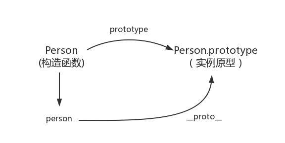

# JavaScript基础知识

<!-- bind的实现 -->
## bind的实现  
### bind是什么？  
一句话介绍bind:  
> `bind()`方法会创建一个新函数。当这个新函数被调用时，bind()的第一个参数将作为它运行平时的this，之后的序列参数将会在传递的实参前传入作为它的参数，供调用时使用。（来自于[MDN](https://developer.mozilla.org/zh-CN/docs/Web/JavaScript/Reference/Global_Objects/Function/bind)）  
由此可以首先得出`bind`函数的两个特点：  
1、返回一个函数  
2、可以传入参数

### 返回函数的模拟实现  
从第一个特点开始，举个例子：  
```js
var foo = {
  value: 1
};

function bar() {
  console.log(this.value);
}

// 返回了一个函数
var bindFoo = bar.bind(foo);

bindFoo(); // 1
```

关于指定`this`的指向，可以使用`call`或者`apply`实现。    
```js
// 第一版代码
Function.prototype.bind2 = function(context) {
  var self = this;
  return function() {
    return self.apply(context);
  }
}
```  
此外，之所以`return self.apply(context)`，是考虑到绑定函数可能是有返回值的，依然是这个例子：  
```js
var foo = {
  value: 1
};

function bar() {
  return this.value;
}

var bindFoo = bar.bind(foo);

console.log(bindFoo()); // 1
```

### 传参的模拟实现  
接下来看第二点，可以传入参数。这个就有点让人费解了，我在`bind`的时候，是否可以传参呢？我在执行`bind`返回的函数的时候，可不可以传参呢？接下来看个例子：  
```js
var foo = {
  value: 1
};

function bar(name, age) {
  console.log(this.value);
  console.log(name);
  console.log(age);
}

var bindFoo = bar.bind(foo, 'xiaoming');
bindFoo(18);
// 1
// xiaoming
// 18
```

函数需要传`name`和`age`两个参数，竟然还可以在`bind`的时候，只传一个`name`，在执行返回的函数的时候，再传另一个参数`age!`这可咋办？不急，可以用`arguments`进行处理：  
```js
// 第二版
Function.prototype.bind2 = function () {
  var self = this;
  // 获取bind2函数从第二个参数到最后一个参数
  var args = Array.prototype.slice.call(arguments, 1);

  return function () {
    // 这个时候的arguments是指bind返回的函数传入的参数
    var bindArgs = Array.prototype.slice.call(arguments);
    return self.apply(context, args.concat(bindArgs));
  }
}
```

### 构造函数效果的模拟实现  
完成了这两点，最难的部分到了！因为`bind`还有一个特点，就是：  
> 一个绑定函数也能使用new操作符创建对象：这种行为就像把原函数当成构造器。提供的this值被忽略，同时调用时的参数被提供给模拟函数。

也就是说当`bind`返回的函数作为构造函数的时候，`bind`时指定的`this`值会失效，但传入的参数依然生效。举个例子：  
```js
var value = 2;

var foo = {
  value: 1
};

function bar(name, age) {
  this.habit = 'shopping';
  console.log(this.value);
  console.log(name);
  console.log(age);
}

bar.prototype.friend = 'xiaoming';

var bindFoo = bar.bind(foo, 'xiaohong')；

var obj = new bindFoo(18);
// undefined
// xiaohong
// 18
console.log(obj.habit);n
console.log(obj.friend);
// shopping
// xiaoming
```

::: warning
注意：尽管在全局和foo中都声明了value值，最后依然返回了undefined，说明绑定的this失效了，如果了解new的模拟实现，就会知道这个时候的this已经指向了obj。
:::

所以可以通过修改返回的函数的原型来实现：  
```js
// 第三版
Function.prototype.bind2 = function(context) {
  var self = this;
  var args = Array.prototype.slice.call(arguments, 1);

  var fBound = function() {
    var bindArgs = Array.prototype.slice.call(arguments);
    // 当作为函数时，this指向实例，此时结果为true，将绑定函数的this指向该实例，可以让实例获得来自绑定函数的值。
    // 以上的都是demo为例，如果改成 `this instanceof fBound ? null : context`，实例只是一个空对象，将null改成this, 实例会具有habit属性
    // 当作为普通函数时，this指向window，此时结果为false，将绑定函数的this指向context
    return self.apply(this.instanceof fBound ? this : context, args.concat(bindArgs));
  }
  // 修改返回函数的prototype为绑定函数的prototype，实例就可以继承绑定函数的原型中的值
  fBound.prototype = this.prototype;
  return fBound;
}
```

### 构造函数效果的优化实现  
但是在这个写法中，直接将`fBound.prototype = this.prototype`，可以直接修改`fBound.prototype`的时候，也会直接修改绑定函数的`prototype`。这个时候，可以通过一个空函数来进行中转：  
```js
// 第四版
Function.prototype.bind2 = function(context) {
  var self = this;
  var args = Array.prototype.slice.call(arguments, 1);

  var fNOP = function () {};

  var fBound = function () {
    var bindArgs = Array.prototype.slice.call(arguments);
    return self.apply(this instanceof fNOP ? this : context, args.concat(bindArgs));
  }

  fNOP.prototype = this.prototype;
  fBound.prototype = new fNOP();
  return fBound;
}
```

### 两个小问题  
接下来处理些小问题  
#### 1、调用bind的不是函数怎么办？  
要给出报错：  
```js
if (typeof this != "function") {
  throw new Error("Function.prototype.bind - what is trying to be bound is not callable");
}
```  
#### 2、在线上使用  
别忘了做个兼容  
```js
Function.prototype.bind = Function.prototype.bind || function () {
  .....
}
```  

### 最终代码  
```js
Function.prototype.bind2 = function(context) {
  if (typeof this !== "function") {
    throw new Error("Function.prototype.bind - what is trying to be bound is not callable")；
  }

  var self = this;
  var args = Array.prototype.slice.call(arguments, 1);

  var fNOP = function() {};

  var fBound = function () {
    var bindArgs = Array.prototype.slice.call(arguments);
    return self.apply(this. instanceof fNOP ? this : context, args.concat(bindArgs));
  }

  fNOP.prototype = this.prototype;
  fBound.prototype = new fNOP();
  return fBound;
}
```
***

## new操作符的原理和实现  
### new是什么？  
一句话介绍new：  
> new 运算符创建一个用户定义的对象类型的实例或具有构造函数的内置对象类型之一  
也许有点难懂，在模拟`new`之前，先看看`new`实现了哪些功能。

举个例子：  
```js
// Otaku 
function Otaku(name, age) {
  this.name = name;
  this.age = age;

  this.habit = 'Games';
}

Otaku.prototype.strength = 60;
Otaku.prototype.sayYourName = function () {
  console.log('I am' + this.name);
}

var person = new Otaku('xiaoming', 18);

console.log(person.name) // xiaoming
console.log(person.habit) // 'Games'
console.log(person.strength) // 60

person.sayYourName(); // I am xiaoming
```  
从这个例子中，可以看到，实例`person`可以：  
1、访问到`Otaku`构造函数里的属性  
2、访问到`Otaku.prototype`中的属性

接下来，可以尝试着模拟一下了。

因为`new`是关键字，所以无法像bind函数一样直接覆盖，所以写一个函数，命名为`objectFactory`，来模拟`new`的效果。用的时候是这样的：  
```js
function Otaku() {
  .....
}

// 使用 new
var person = new Otaku(.....);
var person = objectFactory(Otaku, .....);
```

### 初步实现  
分析：  
因为`new`的结果是一个新对象，所以在模拟实现的时候，也要建立一个新对象，假设这个对象叫`obj`，因为`obj`会具有`Otaku`构造函数里面的属性，想想经典继承的例子，可以使用`Otaku.apply(obj, arguments)`来给`obj`添加新的属性。

现在，我们可以尝试着写第一版了：  
```js
// 第一版代码
function objectFactory() {
  var obj = new Object(),
  Constructor = [].shift.call(arguments);

  obj.__proto__ = Constrcutor.prototype;
  Constructor.apply(obj, arguments);

  return obj;
};
```  
在这一版中，我们：  
1、用`new Object()`的方式新建了一个对象`obj`  
2、取出第一个参数，就是我们要传入的构造函数。此外因为`shift`会修改原数组，所以`arguments`会被去除第一个参数  
3、将`obj`的原型指向构造函数，这样`obj`就可以用访问到构造函数原型中的属性  
4、使用`apply`，改变构造函数`this`的指向到新建的对象，这样`obj`就可以访问到构造函数的属性  
5、返回`obj`

复制以下的代码，到浏览器中，我们可以做一下测试：  
```js
function Otaku (name, age) {
    this.name = name;
    this.age = age;

    this.habit = 'Games';
}

Otaku.prototype.strength = 60;

Otaku.prototype.sayYourName = function () {
    console.log('I am ' + this.name);
}

function objectFactory() {
    var obj = new Object(),
    Constructor = [].shift.call(arguments);
    obj.__proto__ = Constructor.prototype;
    Constructor.apply(obj, arguments);
    return obj;
};

var person = objectFactory(Otaku, 'xiaoming', '18')

console.log(person.name) // xiaoming
console.log(person.habit) // Games
console.log(person.strength) // 60

person.sayYourName(); // I am xiaoming
```

### 返回值效果实现  
接下来再来看一种情况，假如构造函数有返回值，举个例子：  
```js
function Otaku (name, age) {
  this.strength = 60;
  this.age = age;

  return {
    name: name,
    habit: 'Games'
  }
}

var person = new Otaku('xiaoming', 18);

console.log(person.name) // xiaoming
console.log(person.habit) // Games
console.log(person.strength) // undefined
console.log(person.age) // undefined
```  
在这个例子中，构造函数返回了一个对象，在实例`person`中只能访问返回的对象中的属性。
而且还要注意一点，在这里是返回了一个对象，假如只是返回一个基本类型的值呢？  
再举个例子：  
```js
function Otaku(name, age) {
  this.strength = 60;
  this.age = age;

  return 'handsome boy';
}

var person = new Otaku('xiaoming', 18);

console.log(person.name) // undefined
console.log(person.habit) // undefined
console.log(person.strength) // 60
console.log(person.age) // 18
```  
结果完全颠倒过来，这次尽管有返回值，但是相当于没有返回值进行处理。  
所以我们还需要判断返回的值是不是一个对象，如果是一个对象，就返回这个对象，如果没有，该返回什么就返回什么。  
再来看第二版的代码，也是最后一版的代码：  
```js
// 第二版代码
function objectFactory() {
  var obj = new Object(),
  Constructor = [].shift.call(arguments);
  obj.__proto__ = Constructor.prototype;
  var ret = Constructor.apply(obj, arguments);
  return typeof ret === 'object' ? ret : obj;
}
```

***

## apply和call  
### call是什么？
一句话介绍`call`  
> call()方法在使用一个指定的this值和若干个指定的参数值的前提下调用某个函数或方法。  

举个例子：  
```js
var foo = {
  value: 1
};

function bar () {
  console.log(this.value);
}

bar.call(foo) // 1
```  
注意两点：  
1、`call`改变了`this`的指向，指向到`foo`  
2、`bar`函数执行了

### 模拟实现第一步  
那么该怎么模拟实现这两个效果呢？  
试想当调用call的时候，把`foo`对象改造成如下：  
```js
var foo = {
  value: 1,
  bar: function() {
    console.log(this.value)
  }
};

foo.bar(); // 1
```  
这个时候`this`就指向了`foo`，是不是很简单呢？  
但是这样却给`foo`对象本身添加了一个属性，这不符合预期！  
不过也不用担心，用delete再删除它不就好了~  
所以模拟的步骤可以分为：  
1、将函数设为对象的属性  
2、执行该函数  
3、删除该函数

以上个例子为例，就是：  
```js
// 第一步
foo.fn = bar
// 第二步
foo.fn()
// 第三步
delete foo.fn
```  
`fn`是对象的属性名，反正最后也要删除它，所以起成什么都无所谓。  
根据这个思路，可以尝试着去写第一版的`call2`函数：  
```js
// 第一版
Function.prototype.call2 = function(context) {
  // 首先要获取调用call的函数，用this可以获取
  context.fn = this;
  context.fn();
  delete context.fn;
}

// 测试一下
var foo = {
  value: 1
}

function bar () {
  console.log(this.value);
}

bar.call2(foo); // 1
```  
正好可以打印`1`，是不是很开心~  

### 模拟实现第二步  
从一开始也讲了，`call`函数还能给定参数执行函数。举个例子：  
```js
var foo = {
  value: 1
};

function bar(name, age) {
  console.log(name);
  console.log(age);
  console.log(this.value);
}

bar.call(foo, 'xiaoming', 18);
// xiaoming
// 18
// 1
```  
::: warning
注意：传入的参数并不确定，这可咋办？  
不急，可以从Arguments对象中取值，取出第二个到最后一个参数，然后放到一个数组里。
:::  
比如这样：   
```js
// 以上个例子为例，此时的arguments为：
// arguments = {
//   0: foo,
//   1: 'xiaoming',
//   2: 18,
//   length: 3
// }
// 因为arguments是类数组对象，所以可以用for循环
var args = [];
for (var i = 1, len = arguments.length; i < len; i++>) {
  args.push(`arguments[${i}]`);
}

// 执行后args为【“arguments[1]”, “arguments[2]”, “arguments[3]”】
```  
不确定长的参数问题解决了，接着要把这个参数数组放到要执行的函数的参数里面去。  
```js
// 将数组里面的元素作为多个参数放进函数的形参里
context.fn(args.join(','))
// ??
// 这个方法肯定是不行的！！
```  
也许有人想到用ES6的方法，不过call是ES3的方法，为了模拟实现一个ES3的方法，要用到ES6的方法，这就有点说不过去了。不过....，反正也都是学习，嘻嘻。  
这次用eval方法拼成一个函数，类似于这样：  
```js
eval('context.fn(' + args + ')')
```  
这里`args`会自动调用`Array.toString()`这个方法。  
所以第二版克服了两个大总是，代码如下：  
```js
// 第二版
Function.prototype.call2 = function(context) {
  context.fn = this;
  var args = [];
  for (var i = 1, len = arguments.length; i < len; i++) {
    args.push(`arguments[${i}]`);
  }
  eval('context.fn(' + args + ')');
  delete context.fn;
}

// 测试一下
var foo = {
  value: 1
};

function bar(name, age) {
  console.log(name)
  console.log(age)
  console.log(this.value)
}

bar.call2(foo, 'xiaoming', 18);
// xiaom
// 18
// 1
```  
模拟第二步完毕  

### 模拟实现第三步  
模拟代码已经完成80%，还有两个小点要注意：  
1、`this`参数可以传`null`，当为`null`的时候，视为指定`window`  
举个例子：  
```js
var value = 1;

function bar() {
  console.log(this.value);
}

bar.call(null) // 1
```  
虽然这个例子本身不使用call，结果依然一样。  
2、函数是可以有返回值的！  
举个例子：  
```js
var obj = {
  value: 1
}

function bar (name, ages) {
  return {
    value: this.value,
    name: name,
    age: age
  }
}

console.log(bar.call(obj, 'xiaoming', 18));
// Object {
//   value: 1,
//   name: 'xiaoming',
//   age: 18
// }
```  
不过都很好解决，直接看第三版也是就最后一版的代码：  
```js
// 第三版
Function.prototype.call2 = function (context) {
  var context = context || window;
  context.fn = this;

  var args = [];
  for (var i = 1, len = arguments.length; i < len; i++) {
    args.push(`arguments[${i}]`);
  }

  var result = eval('context.fn(' + args + ')');

  delete context.fn;
  return result;
}

// 测试一下
var value = 2;

var obj = {
  value: 1
}

function bar (name, age) {
  console.log(this.value);
  return {
    value: this.value,
    name: name,
    age: age
  }
}

bar.call2(null) // 2

console.log(bar.call2(obj, 'xiaoming', 18));
// 1
// Object {
//   value: 1,
//   name: 'xiaoming',
//   age: 18
// }
```  
到此，完成了`call`的模拟实现。

### apply的模拟实现   
`apply`的实现跟`call`类似，在这里直接给代码：  
```js
Function.prototype.apply = function (context, arr) {
  var context = Object(context) || window;
  context.fn = this;

  var result;
  if (!arr) {
    result = context.fn();
  } else {
    var args = []
    for (var i = 1, len = arguments.length; i < len; i++) {
      args.push(`arguments[${i}]`);
    }
    result = eval('context.fn(' + args + ')')
  }

  delete context.fn;
  return result;
}
```

***

## 原型、原型链

### prototype

每个函数都有一个`prototype`属性，就是我们经常在各种例子中看到的那个`prototype`。  

**例子**：

```js
function Person() {

}
var person = new Person();
person.name = 'xiaoming';
console.log(person.name); // xiaoming
```

在这个例子中，`Person`就是一个构造函数，我们使用了`new`创建了一个实例对象就是`person`。

函数就是一个构造器(可以是`class`类，或者是工厂函数的叫法，`new`出来的，叫实例对象。这块知识以前都是比较模糊的，这里重点记一下笔记。)

**比如**：

```js
function Person() {

}
// prototype是函数才会有的属性
Person.prototype.name = 'xiaoming';
var person1 = new Person();
var person2 = new Person();
console.log(person1.name) // 'xiaoming'
console.log(person2.name) // 'xiaoming'
```
这个例子中的函数`prototype`属性指向了一个对象，这个对象正是调用该构造函数创建的实例的原型，也就是这个例子中的`person1`和`person2`的原型。

那么什么是原型呢？你可以这样理解：每一个`JavaScript`对象(`null`除外)在创建的时候就会与之关联另一个对象，这个对象就是我们所说的原型，每个对象都会从原型“继承”属性。

用一张图表示构造函数和实例原型之间的关系图：


在这张图中用`Object.prototype`表示实例原型。

那么该怎么表示实例与实例原型，也就是`person`与`person.prototype`之间的关系呢，这时候我们就要讲到第二个属性：

### \_\_proto\_\_

这是每个`JavaScript`对象(除了null)都具有的一个属性，叫`__proto__`，这个属性会指向该对象的原型。  
为了证明这一点，可以在火狐或者谷歌中输入：  
```js
function Person() {

}
var person = new Person();
console.log(person.__proto__ === Person.prototype); // true
```
于是更新下原型和原型链关系图：  


既然实例对象和构造函数都可以指向原型，那么原型是否有属性指向构造函数或者实例呢？

### constructor
指向实例倒是没有，因为一个构造函数可以生成多个实例，但是原型指向函数倒是有的，这就要讲到第三个属性：  
`constructor`，每个原型都有一个`constructor`属性指向关联的构造函数。

为了验证这一点，可以尝试：
```js
function Person() {

}
console.log(Person === Person.prototype.constructor) // true
```  
所以再更新下关系图：  
  
综上已经得出：  
```js
function Person () {

}
var person = new Person()
console.log(person.__proto__ === Person.prototype) // true
console.log(Person.prototype.constructor === Person) // true
// 顺便学习一个ES5的方法，可以获得对象的原型
console.log(Object.getPrototypeOf(person === Person.prototype)) // true
```  
了解了构造函数、实例原型和实例之间的关系，接下来讲讲实例和原型的关系

### 实例与原型

当读取实例的属性时，如果找不到，就会查找与对象关联的原型中的属性，如果还查不到，就去找原型的原型，一直找到最顶层为止。

举个例子：  
```js
function Person () {

}
Person.prototype.name = 'xiaoming'

var person = new Person()
person.name = 'xiaohong'
console.log(person.name) // xiaohong

delete person.name
console.log(person.name) // xiaoming
```  
在这个例子中，给实例对象`person`添加了`name`属性，当我们打印person.name的时候，结果自然为`xiaohong`。

但是当删除了`person`的`name`属性时，读取`person.name`，从`person`对象中找不到的`name`属性就会`person`的原型也就是`person.__proto__`，也就是`Person.prototype`中查找，幸运的是我们找到了`name`属性，结果为`xiaoming`。

但是万一还没有找到呢？原型的原型又是什么呢？

### 原型的原型

在前面，已经讲了原型也是一个对象，既然是对象，就可以用最原始的方式创建它，那就是：  
```js
var obj = new Object();
obj.name = 'xiaoming';
console.log(obj.name); // xiaoming
```  
其实原型对象就是通过`Object`构造函数生成的，结合之前所讲的，实例的`__proto__`指向构造函数的`prototype`，所以再更新下关系图：  


### 原型链

那`Object.prototype`的原型呢？

`null`，我们可以打印：  
```js
console.log(Object.prototype.__proto__ === null) // true
```  
然而`null`究竟代表了什么呢？  
引用阮一峰老师的[《undefined与null的区别》](https://www.ruanyifeng.com/blog/2014/03/undefined-vs-null.html)就是：  
> `null`表示“没有对象”，即该处不应该有值。

所以查找属性的时候查到`Object.prototype`就可以停止查找了。

最后一张关系图也可以更新为：  
  
顺便还要说一下，图中由相互关联的原型组成的链状结构就是原型链，也就是蓝色的这条线。

#### 补充

最后，补充三点可能不会注意的地方：

#### constructor  
首先是`constructor`属性，看个例子：  
```js
function Person() {

}
var person = new Person()
console.log(person.constructor === Person) // true
```

当获取`person.constructor`时，其实`person`中并没有`constructor`属性，当不能读取到`constructor`属性时，会从`person`的原型也就是`Person.prototype`中读取，正好原型中有该属性，所以：  
```js
person.constructor === Person.prototype.constructor
```

#### \_\_proto\_\_  
其次是`__proto__`，绝大部分浏览器都支持这个非标准的方法访问原型，然而它并不存在于`Person.prototype`中，实际上，它是来自于`Object.prototype`，与其说是一个属性，不如说是一个`getter/setter`，当使用`obj.__proto__`时，可以理解成返回了`Object.getPrototypeOf(obj)`。

#### 真的是继承吗？  
最后是关于继承，前面讲到“每一个对象都会从原型“继承”属性”，实际上，继承是一个十分具有迷惑的说法，引用《你不知道的JavaScript》中的话，就是：  
继承意味着复制操作，然而`JavaScript`默认并不会复制对象的属性，相反，`JavaScript`只是在两个对象之间创建一个关联，这样，一个对象就可以通过委托访问另一个对象的属性和函数，所以与其叫继承，委托的说法反而更准确些。

***

## 继承

记录JavaScript各种继承方式和优缺点。

### 原型链继承  
```js
function Parent() {
  this.name = 'xiaoming';
}

Parent.prototype.getName = function() {
  console.log(this.name);
}

function Child() {

}

Child.prototype = new Parent();

var child1 = new Child();

console.log(child1.getName()); // xiaoming
```

问题:  
1、引用类型的属性被所有实例共享，举个例子：  
```js
function Parent() {
  this.names = ['xiaoming', 'xiaohong'];
}

function Child() {

}

Child.prototype = new Parent();

var child1 = new Child();
child1.names.push('zhangsan');

console.log(child1.names) // ['xiaoming', 'xiaohong', 'zhangsan']

var child2 = new Child()

console.log(child2.names) // ['xiaoming', 'xiaohong', 'zhangsan']
```

2、在创建`Child`的实例时，不能向`Parent`传参

### 借用构造函数（经典继承）  
```js
function Parent() {
  this.names = ['xiaoming', 'xiaohong'];
}

function Child() {
  Parent.call(this);
}

var child1 = new Child();
child1.names.push('zhangsan');

console.log(child1.names); // ['xiaoming', 'xiaohong', 'zhangsan']

var child2 = new Child();
console.log(child2.names); // ['xiaoming', 'xiaohong']
```  
优点：  
1、避免了引用类型的属性被所有实例共享。
2、可以在`Child`中向`Parent`传参

举个例子：  
```js
function Parent(name) {
  this.name = name;
}

function Child(name) {
  Parent.call(this, name);
}

var child1 = new Child('xiaoming');
console.log(child1.name); // xiaoming

var child2 = new Child('xiaohong')
console.log(child2.name); // xiaohong
```  
缺点：  
方法都在构造函数中定义，每次创建实例都会创建一遍方法。

### 组合继承  
原型链继承和经典继承双剑合璧  
```js
function Parent(name) {
  this.name = name;
  this.colors = ['res', 'blue', 'green'];
}

Parent.prototype.getName = function() {
  console.log(this.name);
}

function Child(name, age) {
  Parent.call(this, name);
  
  this.age = age;
}

Child.prototype = new Parent();
Child.prototype.constructor = Child;

var child1 = new Child('xiaoming', 18);
child1.colors.push('black');

console.log(child1.name); // xiaoming
console.log(child1.age); // 18
console.log(child1.colors); // ['red', 'blue', 'green', 'black']

var child2 = new Child('xiaohong', 20)

console.log(child2.name); // xiaohong
console.log(child2.age); // 20
console.log(child2.colors); // ['red', 'blue', 'green']
```  
优点：融合原型链继承和构造函数的优点，是JavaScript中最常用的继承模式。

### 原型式继承  
```js
function createObj(o) {
  function F() {}
  F.prototype = o;
  return new F();
}
```  
就是`ES5 Object.create`的模拟实现，将传入的对象作为创建的对象的原型。  
缺点：  
包含引用类型的属性始终都会共享相应的值，这点跟原型链继承一样。  
```js
var person = {
  name: 'xiaoming',
  firends: ['xiaohong', 'zhangsan']
}

var person1 = createObj(person);
var person2 = createObj(person);

person1.name = 'person1'
console.log(person2.name); // xiaoming

person1.firends.push('lisi');
console.log(person2.friends); // ['xiaohong', 'zhangsan', 'lisi']
```  
:::warning
注意：修改`person1.name`的值，`person2.name`的值并未发生改变，并不是因为`person1`和`person2`有独立的`name`值，而是因为`persion1.name = 'persion1'`，给`persion1`添加了`name`值，并非修改了原型上的`name`值。
:::

### 寄生式继承  
创建一个仅用于封装继承过程的函数，该函数在内部以某种形式来做增强对象，最后返回对象。  
```js
function createObj(o) {
  var clone = Object.create(o);
  clone.sayName = function () {
    console.log('hi');
  }
  return clone
}
```  
缺点：跟借用构造函数模式一样，每次创建对象都会创建一遍方法。

### 寄生组合式继承  
为了方便阅读，在这里重复一下组合继承的代码：  
```js
function Parent(name) {
  this.name = name;
  this.colors = ['red', 'blue', 'green'];
}

Parent.prototype.getName = function() {
  consloe.log(this.name);
}

function Child(name, age) {
  Parent.call(this, name);
  this.age = age;
}

Child.prototype = new Parent();

var child1 = new Child('xiaoming', 18);
console.log(child1)
```  
组合继承最大的缺点就是会调用两次父构造函数。  
一次是设置子类型实例的原型的时候：  
```js
Child.prototype = new Parent();
```  
一次在创建子类型实例的时候：  
```js
var child1 = new Child('xiaoming', 18);
```  
回想下`new`的模拟实现，其实在这句中，会执行：  
```js
Parent.call(this, name);
```  
在这里，又会调用了一次`Parent`构造函数。  
所以，在这个例子中，如果是打印`child1`对象，会发现`Child.prototype`和`child1`都有一个属性为`colors`，属性值为`['red', 'blue', 'green']`。  
那么该如何精益求精，避免这一次重复调用呢？  
如果不使用`Child.prototype = new Parent()`，而是间接的让`Child.prototype`访问到`Parent.prototype`呢？  

看看如何实现：  
```js
function Parent(name) {
  this.name = name;
  this.colors = ['red', 'blue', 'green'];
}

Parent.prototype.getName = function () {
  console.log(this.name)
}

function Child(name, age) {
  Parent.call(this, name);
  this.age = age;
}

// 关键的三步
var F = function () {};
F.prototype = Parent.prototype;
Child.prototype = new F();

var child1 = new Child('xiaoming', 18);
console.log(child1);
```  
最后封装一下这个继承方法：  
```js
function object(o) {
  function f() {};
  f.prototype = o;
  return new F();
}

function prototype(child, parent) {
  var prototype = object(parent.prototype);
  prototype.constructor = child;
  child.prototype = prototype;
}

prototype(Child, Parent);
```  
引用《JavaScript高级程序设计》中对寄生组合工继承的夸赞就是：  
这种方式的高效率体现它只调用了一次`Parent`构造函数，并且因此避免了在`Parent.prototype`上而创建不必要的、多余的属性。与些同时，原型链还能保持不变；因此，还能够正常使用`instanceof`和`isPrototypeOf`。开发人员普遍认为寄生组合式继承是引用类型最理想的继承范式。

***

## 闭包  
### 定义  
MDN对闭包的定义：  
> 闭包是指那些能够访问自由变量的函数。  
那什么是自由变量呢？  
> 自由变量是指在函数中使用的，但既不是函数参数也不是函数的局部变量的变量。  
由此，可以看出闭包共有两部分组成：  
> 闭包 = 函数 + 函数能够访问的自由变量  

举个例子：  
```js
var a = 1;

function foo () {
  console.log(a);
}

foo();
```  
`foo`函数可以访问变量`a`，但是`a`既不是foo函数的局部变量，也不是`foo`函数的参数，所以`a`就是自由变量。  
那么，函数`foo + foo`函数访问的自由变量`a`不就是构成了一个闭包嘛。。。。  
还真是这样的！！  
所以在《JavaScript权威指南》中就讲到：从技术的角度讲，所有的JavaScript函数都是闭包。  
咦，这怎么跟我们平时看到的讲到的闭包不一样呢！？  
别着急，这是理论上的闭包，其实还有一个实践角度上的闭包：  
ECMAScript中，闭包指的是：  
1、从理论角度：所有的函数。因为它们都创建的时候就将上层上下文的数据保存起来了。哪怕是简单的全局变量也是如此，因为函数中访问全局变量就相当于是在访问自由变量，这个时候使用最外层的作用域。  
2、从实践角度：以下函数才算是闭包：  
 i: 即使创建它的上下文已经销毁，它仍然存在（比如，内部函数从父函数中返回）  
 ii: 在代码中引用了自由变量  

接下来就来讲讲实践上的闭包。  

### 分析  
先写个例子，例子依然是来自《JavaScript权威指南》，稍微做点发动：  
```js
var scope = "global scope";

function checkscope() {
  var scope = "local scope";
  function f () {
    return scope;
  }
  return f;
}

var foo = checkscope();
foo()
```  
首先要分析一下这段代码中执行上下文栈和执行上下文的变化情况。  

这里直接给出简要的执行过程：  
:::tip
1、进入全局代码，创建全局执行上下文，全局执行上下文压入执行上下文栈  
2、全局执行上下文初始化  
3、执行`checkscope`函数，创建`checkscope`函数执行上下文，`checkscope`执行上下文被压入执行上下文栈  
4、`checkscope`执行上下文初始化，创建变量对象、作用域链、`this`等  
5、`checkscope`函数执行完毕，`checkscope`执行上下文从执行上下文栈中弹出  
6、执行`f`函数，创建`f`函数执行上下文，`f`执行上下文被压入执行上下文栈  
7、`f`执行上下文初始化，创建变量对象、作用域链、this等  
8、`f`函数执行完毕，`f`函数上下文从执行上下文栈中弹出
:::  
了解到这个过程，应该思考一个问题，那就是：  
当`f`函数执行的时候，`checkscope`函数上下文已经被销毁了（即从执行上下文栈中弹出），怎么还会读取到`checkscope`作用域下的`scope`值呢？  

当了解了具体的执行过程后，知道`f`执行上下文维护了一个作用链：  
```js
fContext = {
  Scope: [AO, checkscopeContext.AO, globalContext.VO]
}
```  
对的，就是因为这个作用域链，`f`函数依然可以读取到`checkscopeContext.AO`的值，说明当`f`函数引用了`checkscopeContext.AO`中的值的时候，即使`checkscopeContext`被销毁了，但是JavaScript依然会让`checkscopeContext.AO`活在内存中，`f`函数依然可以通过`f`函数的作用域链找到它，正是因为JavaScript做到了这一点，从而实现了闭包这个概念。  

所以，再看一遍实践角度上闭包的定义：  
1、即使创建它的上下文已经销毁，它仍然存在（比如，内部函数从父函数返回）  
2、在代码中引用了自由变量  

在这里再补充一个《JavaScript权威指南》英文原版对闭包的定义：  
> This combination of a function object and a scope (a set of variable bindings) in which the function's variables are resolved is called a closure in the computer science literature.  

闭包在计算机科学中也只是一个普通的概念，不要去想得太复杂。

### 必刷题  
接下来，看这道刷题必刷，面试必考的闭包题：  
```js
var data = []

for(var i = 0; i < 3; i++) {
  data[i] = function () {
    console.log(i)
  };
}

data[0]();
data[1]();
data[2]();
```  
答案都是3，分析一下原因：  
当执行到`data[0]`函数之前，此时全局上下文的`VO`为：  
```js
globalContext = {
  VO: {
    data: [...],
    i: 3
  }
}
```  
当执行`data[0]`函数的时候，`data[0]`函数的作用域链为：  
```js
data[0]Context = {
  Scope: [AO, globalContext.VO]
}
```  
`data[0]Context`的`AO`并没有`i`值，所以会从`globalContext.VO`中查找，`i`为`3`，所以打印的结果就是`3`。  
`data[1]`和`data[2]`是一样的道理。  
所以改成闭包看看：  
```js
var data = [];

for (var i = 0; i < 3; i++) {
  data[i] = (function (i) {
    return function () {
      console.log(i);
    }
  })
}

data[0]();
data[1]();
data[2]();
```  
当执行到`data[0]`函数之前，此时全局上下文的`VO`为：  
```js
globalContext = {
  VO: {
    data: [...],
    i: 3
  }
}
```  
跟没改之前一模一样。  
当执行`data[0]`函数的时候，`data[0]`函数的作用域链发生了改变：  
```js
data[0]Context = {
  Scope: [AO, 匿名函数Context.AO globalContext.VO]
}
```  
匿名函数执行上下文的AO为：  
```js
匿名函数Context = {
  AO: {
    arguments: {
      0: 0,
      length: 1
    },
    i: 0
  }
}  
```  
`data[0]Context`的`AO`并没有`i`值，所以会沿着作用域链从匿名函数`Context.AO`中查找，这时候就会找`i`为`0`，找到了就不会往`globalContext.VO`中查找了，即使`globalContext.VO`也有`i`的值（值为`3`），所以打印的结果就是`0`。  

`data[1]`和`data[2]`是一样的道理

***

## 变量提升  
变量对象是与执行上下文相关的数据作用域，存储了在上下文中定义的变量和函数声明。  
因为不同执行上下文下的变量对象稍有不同，所以全局上下文下的变量对象和函数上下文下的变量对象。  

### 全局上下文  
先了解一个概念，叫全局对象。在[W3School](https://www.w3school.com.cn/jsref/jsref_obj_global.asp)中也介绍：  
> 全局对象是预定义的对象，作为JavaScript的全局函数和全局属性的点位符。通过使用全局对象，可以访问所有其他所有预定义的对象、函数和属性。  
> 在顶层JavaScript代码中，可以用关键字this引用全局对象。因为全局对象是作用域链的头，这意味着所有非限定性的变量和函数名都会作为该对象的属性来查询。  
> 例如，当JavaScript代码引用parseInt()函数时，它引用的是全局对象的parseInt属性。全局对象是作用域链的头，还意味着在顶层JavaScript代码中声明的所有变量都将成为全局对象的属性。  

如果看的不是很懂的话，请继续看下面的全局对象的介绍：  
1、可以通过`this`引用，在客户端`JavaScript`中，全局对象就是`Window`对象。  
```js
console.log(this);
```  
2、全局对象是由`Object`构造函数实例化的一个对象。  
```js
console.log(this instanceof Object);
```  
3、预定义了一堆，一大堆函数和属性。  
```js
console.log(Math.random());
console.log(this.Math.random());
```  
4、作为全局变量的宿主。  
```js
var a = 1;
console.log(this.a);
```  
5、客户端`JavaScript`中，全局对象有`window`属性指向自身  
```js
var a = 1;
console.log(window.a);

this.window.b = 2;
console.log(this.b);
```  
花了一个大篇幅介绍全局对象，其他就想说：  
全局上下文中的变量对象就是全局对象！  

### 函数上下文  
在函数上下文中，用活动对象`(activation object, AO)`来表示变量对象。  

活动对象和变量对象其实是一个东西，只是变量对象是规范上的或者说是引擎实现上的，不可在`JavaScript`环境中访问，只有到当进入一个执行上下文中，这个执行上下文的变量对象才会被激活，所有才叫`activation object`，而只有被激活的变量对象，也就是活动对象上的各种属性才能被访问。  

活动对象是在进入函数上下文时刻被创建的，它通过函数的`arguments`属性初始化。`arguments`属性值是`Arguments`对象。  

### 执行过程  
执行上下文的代码会分成两个阶段进行处理：分析和执行，也可以叫做：  
1、进入执行上下文  
2、代码执行  

### 进入执行上下文  
当进入执行上下文时，这时候还没有执行代码，  
变量对象会包括：  
1、函数的所有形参（如果是函数上下文）  
* 由名称和对应值组成的一个变量对象的属性被创建  
* 没有实参，属性值设为undefined  
2、函数声明  
* 由名称和对应值（函数对象(function-object)）组成一个变量对象的属性被创建  
* 如果变量名称跟已经声明的形式参数或函数相同，则变量声明不会干扰已经存在的这类属性  

举个例子：  
```js
function foo(a) {
  var b = 2;
  function c() {}
  var d = function() {};

  b = 3;
}

foo(1);
```  
在进入执行上下文后，这时候的`AO`是：  
```js
AO = {
  arguments: {
    0: 1,
    length: 1
  },
  a: 1,
  b: undefined,
  c: reference to function c(){},
  d: undefined
}
```  

### 代码执行  
在代码执行阶段，会顺序执行代码，根据代码，修改变量对象的值  
还是上面的例子，当代码执行完后，这时候的`AO`是：  
```js
AO = {
  arguments: {
    0: 1,
    length: 1
  },
  a: 1,
  b: 3,
  c: reference to function c(){},
  d: reference to FunctionExpression: "d"
}
```  
到这里变量对象的创建过程就介绍完了，简洁的总结上述所说：  
1、全局上下文的变量对象初始化是全局对象  
2、函数上下文的变量对象初始化只包括`Arguments`对象  
3、在进入执行上下文时会给变量对象添加形参、函数声明、变量声明等初始的属性值  
4、在代码执行阶段，会再修改变量对象的属性值  

### 思考题  
最后再看几个例子  
1、第一题  
```js
function foo() {
  console.log(a);
  a = 1
}

foo(); // ???

function bar() {
  a = 1;
  console.log(a);
}

bar() // ???
```  
第一段会报错： `Uncaught ReferenceError: a is not defined.`  
第二段会打印： `1`。  
这是因为函数中的`"a"`并没有通过`var`关键字创建，所以不会被存放在`AO`中。  
第一段执行`console`的时候，`AO`的值是：  
```js
AO = {
  arguments: {
    length: 0
  }
}
```  
没有`a`的值，然后就会找到全局去找，全局也没有，所以会报错。  
当第二段执行`console`的时候，全局对象已经被赋予了`a`属性，这时候就可以从全局找到`a`的值，所以会打印`1`。  

2、第二题  
```js
console.log(foo);

function foo() {
  console.log("foo");
}

var foo = 1;
```  
会打印函数，而不是`undefied`。  
这是因为在进入执行上下文时，首先会处理函数声明，首次会处理变量声明，如果变量名称跟已经声明的形式参数或函数相同，则变量声明不会干扰已经存在的这类发属性。


***

## this的指向

## 立即执行函数  
### 它是什么？  
在`JavaScript`里，每个函数，当被调用时，都会创建一个新的执行上下文。因为在函数里定义的变量和函数是唯一在内部被访问的变量，而不是在外部被访问的变量，当调用函数时，函数提供的上下文提供了一个非常简单的方法创建私有变量。  
```js
function makeCounter() {
  var i = 0;
  return function() {
    console.log(i++);
  };
}

// 记住：`counter`和`counter2`都有它们自己的变量`i`

var counter = makeCounter();
counter(); // 1
counter(); // 2

var counter2 = makeCounter();
counter2(); // 1
counter2(); // 2

i; // ReferenceError: i is not defined(它只存在于makeCounter里)
```  
在许多情况下，可能并不需要`makeWhatever`这样的函数返回多次累加值，并且可以只调用一次得一个单一的值，在其他一些情况里，甚至不需要明确的知道返回值。  

### 它的核心  
现在，无论定义一个函数像这样`function foo() {}`或者`var foo = function() {}`，调用时，都需要在后面加上一对圆括号，像这样`foo()`。  
```js
// 向下面这样定义的函数可以通过在函数名称后加一对括号进行调用，像这样`foo()`，
// 因为foo相对于函数表达式`function() {/* code */}`只是一个引用变量

var foo = function () {/* code */}

// 那这可以说明函数表达式可以通过在其后加上一对括号自己调用自己吗？
function() {/* code */}(); // SyntaxError: Unexpected token ()
```  
正如你所看到的，这里捕获了一个错误，当圆括号为了调用出现在函数后面时，无论在全局或者局部环境里面遇到了这样的`function`关键字，默认的，它会将它当作是一个函数声明，而不是函数表达式，如果你不明确的告诉圆括号它是一个表达式，它会将其当作没有名字的函数声明并且抛出一个错误，因为函数声明需要一个名字。  

问题1：这里可以思考一个问题，是不是也可以像这样直接调用函数`var foo = function() {console.log(1)}()`，答案是可以的。  
问题2：同样的，还可以再思考一个问题，像这样的函数声明在后面加上圆括号被直接调用，又会出现什么情况呢？请看下面的解答。  

### 函数，圆括号，错误  
有趣的是，如果你为一个函数指定一个名字并在它后面放一对圆括号，同样的也会抛出错误，但这次是因为另一个原因。当圆括号放在一个函数表达式后面指明了这是一个被调用的函数，而圆括号放在一个声明后面便意味着完全的和前面的函数声明分开了，此时圆括号只是一个简单的代表一个括号(用来控制运算优先的括号)。  
```js
// 然而函数声明语法上是无效的，它仍然是一个声明，紧跟着的圆括号是无效的，因为圆括号里面需要包含表达式

function foo() { /* code */ }();  // SyntaxError: Unexpected token

// 现在，你把一个表达式放在圆括号里面，没有抛出错误... ，但是函数也并没有执行，因为：
;
function foo() {/* code */}(1)

// 它等同于如下，一个函数声明跟着一个完全没有关系的表达式：

function foo() {/* code */}
(1);
```  

### 立即执行函数表达式（IIFE）  
幸运的是，修正语法很简单。最流行的也最被接受的方法是将函数声明包裹在圆括号里来告诉语法分析器去表达一个函数表达式，因为在`JavaScript`里面，圆括号不能包含声明。因为这点，当圆括号为了包裹函数碰上了`function`关键词，它便知道将作为一个函数表达式去解析而不是函数声明。注意理解这里的圆括号和上面的圆括号遇到的函数时的表现是不一样的，也就是说。  
* 当圆括号出现在匿名函数的末尾想要调用函数时，它会默认将函数当成是函数声明。  
* 当圆括号包裹函数时，它会默认将函数作为表达式去解析，而不是函数声明。  

```js
// 这两种模式都可以被用来立即调用一个函数表达式，利用函数的执行来创造私有变量

(function() {/* code */}()); // Crockford recommends this one, 括号内的表达式代表函数立即调用表达式
(function() {/* code */})(); // But this one works just as well，括号内的表达式代表函数表达式

// Because the point of the parens or coercing operators is to disambiguate
// between function expressions and function declarations, they can be
// omitted when the parser already expects an expression (but please see the
// "important note" below).

var i = function() {return 10;}();
true && function() {/* code */}();
0, function() {}();

// 如果你并不关心返回值，或者让你的代码尽可能的易读，你可以通过在你的函数前面带上一个一元操作符来存储字节

!function() {/* code */}();
~function() {/* code */}();
-function() {/* code */}();
+function() {/* code */}();

// Here's another variation, from @kuvos - I'm not sure of the performance
// implications, if any, of using the `new` keyword, but it works.
// http://twitter.com/kuvos/status/18209252090847232

new function() {/* code */}
new function() {/* code */}() // Only need parents if passing arguments
```  

### 关于括号的重要笔记  
在一些情况下，当额外的带着歧义的括号围绕在函数表达式周围是没有必要的(因为这时候的括号已经将其作为一个表达式去表达)，但当括号用于调用函数表达式时，这仍然是一个好主意。  
这样的括号指明函数表达式将会被立即调用，并且变量将会储存函数的结果，而不是函数本身。当这是一个非常长的函数表达式时，这可以节约给人阅读你代码的时间，不用滚到页面底部去看这个函数是否被调用。  
作为规则，当你书写清楚明晰的代码时，有必要阻止`JavaScript`抛出错误的，同样也有必要阻止其他开发者抛出错误`WTFError`！  

### 保存闭包的状态  
就像当函数通过它们的名字被调用时，参数会被传递，而当函数表达式被立即调用时，参数也会被传递。一个立即调用的函数表达式可以用锁定值并且有效的保存此时的状态，因为任何定义在一个函数内的函数都可以使用外面函数传递进来的参数和变量(这种关系被叫做闭包)。  
```js
// 它的运行原理可能并不像你想的那样，因为`i`的值从来没有被锁定
// 相反下，每个链接，当被点击时（循环已经被很好的执行完毕），因此会弹出所有元素的总数，
// 因为这是`i`，此时的真实值

var elems = document.getElementByTagName('a');
for (var i = 0; i < elems.length; i++) {
  elems[i].addEventListener('click', function(e) {
    e.preventDefault();
    alert('I am link #' + i)
  }, false)
}

// 而像下面这样改写，便可以了，因为在IIFE里，`i`值被锁定在了`lockedInIndex`里。
// 在循环结果执行时，尽管`i`值的数值是所有元素的总和，但每一次函数表达式被调用时，
// IIFE里的`lockedInIndex`值都是`i`传给它的值，所以当链接被点击时，正确的值被弹出。

var elems = document.getElementsByTagName('a');
for (var i = 0; i < elems.length; i++) {
  (function(lockedInIndex) {
    elems[i].addEventListener('click', function(e) {
      e.preventDefault();
      alert('I amlink #' + lockedInIndex);
    }, false)
  })(i)
}

// 同样可以像下面这样使用IIFE，仅仅中用括号包括点击处理函数，并不包含整个`addEventListener`。
// 无论用哪种方式，这两个例子都可以用IIFE将值锁定，不过我发现前面一个例子更可读。

var elems = document.getElementByTagName('a');
for (var i = 0; i < elems.length; i++) {
  elems[i].addEventListener('click', (function (lockedInIndex) {
    return function(e) {
      e.preventDefalut();
      alert('I am link #' + lockedInIndex);
    };
  })(i), false);
}
```  
记住，在这最后两个例子里，`lockedInIndex`可以没有任何问题访问`i`，但是作为函数参数使用一个不同的命名标识符可以使概念更加容易的被解释。  
立即执行函数一个最显著的优势是就算它没有命名或者说是匿名，函数表达式也可以在没有使用标识符的情况下被立即调用，一个闭包也可以在没有当前变量污染的情况下被调用。

### 自执行匿名函数("Self-executing anonymous function")有什么问题？  
你看到它已经被提到好几次了，但是它仍然不是那么清楚的被解释，提议将术语改成`immediately-Invoked Function Expression`，或者，`IIFE`，如果喜欢缩写的话。  
什么是`immediately-Invoked Function Expression`呢？它使一个被立即调用的函数表达式，就像引导你去调用的函数表达式。  
`JavaScript`社区的成员应该可以在他们文章里或者陈述里接受术语，`immediately-Invoked Function Expression`和`IIFE`，因为感觉这样更容易让这个概念被理解，并且术语`self-execting anonymous function`真的也不够精确。  
```js
// 下面是个自执行函数，递归的调用自己本身

function foo() {foo();};

// 这是一个自执行函数。因为它没有标识符，它必须是使用`arguments.callee`属性来调用它自己

var foo = function() {arguments.callee();};

// 这也许算是一个自执行函数，但是仅仅当`foo`标识符作为它的引用时，如果你将它换成`foo`来调用同样可行

var foo = function() {foo();};

// 有些人像这样叫`self-executing anonymous function`下面的函数，即使它不是自执行的，因为它并没有调用它自己。然后，它只是被立即调用了而已。

(function() {/* code */}());

// 为函数表达式增加标识符（也就是六创造一个命名函数）对调试会有很大帮助。一旦命名，函数将不再匿名。

(function foo() {/* code */}());

// IIFEs同样也可以自执行，尽管，也许他不是最有用的模式。

(function() {arguments.callee();}())
(function foo() {foo();}())
```  
希望上面的例子可以更加清楚的知道术语`self-executing`是有一些错误的，因为它并不是执行自己的函数，尽管函数已经被执行。同样的，匿名函数也没用必要特别指出，因为，`immediately-Invoked Function Expression`，既可以是命名函数也可以匿名函数。

### 最后：模块模式  
当我调用函数表达式时，如果我不至少一次的提醒我自己关于模块模式，我便很可能会忽略它。如果你并不属于`JavaScript`里的模块模式，它和我下面的例子很像，但是返回值用对象代替了函数。  
```js
var counter = (function() {
  var i = 0;
  return {
    get: funciton() {
      return i;
    },
    set: function (val) {
      i = val;
    },
    increment: function () {
      return i++
    }
  }
}());

counter.get(); // 0
counter.set(3);
counter.increment(); // 4
counter.increment(); // 5

counter.i; // undefined(`i` is not a property of the returned object)
i; // ReferenceeError: i is not defined (it only exists inside the closure)
```  
模块模式方法不仅相当的厉害而且简单。非常少的代码，可以有效的利用与方法和属性相关的命名，在一个对象里，组织全部的模块代码即最小化了全局变量的污染也创造了使用变量。

***

## typeof和instanceof  
### JavaScript数据类型  
有八种内置类型  
* null(空值)
* undefined(未定义)
* boolean(布尔值)
* number(数字)
* object(对象)
* symbol(符号，ES6中新增)
* Bigint(大整数，ES2020引入)  
  
> 除对象外，其他统称为”基本类型“。  

```js
typeof null // 'object'
typeof undefined // 'undefined'
typeof false // 'boolean'
typeof 1 // 'number'
typeof '1' // 'string'
typeof {} // 'object'
typeof [] // 'object'
typeof new Date() // 'object'

typeof Symbol(); // 'Symbol'
typeof 123n  // 'bigint'
```  
这里的类型指的是值，变量是没有类型的，变量可以随时持有任何类型的值。JavaScript中变量是”弱类型“的，一个变量可以现在被赋值为字符串类型，随后又被赋值为数字类型。  

`typeof`是一个操作符而不是函数，用来检测给定变量的数据类型。  
> Symbol 是ES6引入的一种`原始数据`类型，表示独一无二的值。BigInt(大整数)是ES2020引入的一种新的数据类型，用来解决JavaScript中数字只能到53个二进制位（JavaScript所有数字都保存成64们浮点数，大于这个范围的整数，无法精确表示的总问题。（在平常的开发中，数据的id一般用string表示的原因）。）为了与Number类型区别，BigInt类型的数据必须添加后缀n。`1234`为普通整数，`1234n`为`BigInt`。了解更多可以看《ES6入门教程》  

`typeof null`为什么返回`object`，稍后会从JavaScript数据底层存储机制来解释。  

还有一种情况  
```js
function foo() {};
typeof foo; // 'function'
```  
这样看来，`function`也是`JavaScript`的一个`内置类型`。然而查阅规范，就会知道，它实际上是`object`的一个”子类型“。具体来说，函数是”可调用对象“，它有一个内部属性`[[call]]`，该属性使其可以调用。`typeof`可以用来区分函数其他对象。  

但是使用`typeof`不能判断对象具体是哪种类型，所有`typeof`返回值为"object"的对象（如数组，正则等）都包含一个内部属性`[[class]]`(可以把它看做一个内部的分类)。这个属性无法直接访问，一般通过`Object.prototype.toString(...)`来查看。  

```js
Object.prototype.toString.call(new Date); // '[object object]'
Object.prototype.toString.call([]); // '[object Array]'
Object.prototype.toString.call(/reg/ig); // '[object RegExp]'
```  
`instanceof`运算符也常常用来判断对象类型。用法：左边的运算数是一个`object`，右边运算数是对象类的名字或者构造函数；返回`true`或`false`。  

```js
[] instanceof Array; // true
[] instanceof Object; // true
[] instanceof RegExp; // false
new Date instanceof Date; // true
```  
`instanceof`的内部机制是：检测构造函数的`prototype`属性是否出现在某个实例对象的原型链上。下面会详解介绍该部分。  

### typeof原理  
`typeof`原理：不同的对象在底层都表示为二进制，在JavaScript中二进制前（低）三位存储其类型信息。  
* 000：对象
* 010：浮点数
* 100：字符串
* 110：布尔
* 1：整数

`typeof null`为`object`，原因是因为不同的对象在底层都表示为二进制，在JavaScript中二进制前（低）三位都为0的话会被判断为`Object`类型，`null`的二进制表示全为0，自然前三位也是0，所以执行`typeof`时会返回`object`。一个不恰当的例子，假设所有的JavaScript对象都是16位的，也就是有16个0或1组成的序列，猜想如下：  
```js
Array: 1000100010001000
null:  0000000000000000

typeof [] // 'object'
typeof null // 'object'
```  
因为`Array`和`null`的前三位都是000。为什么`Array`的前三位是100? 因为二进制中的”前“一般代表低位，比如二进制000000011对应十进制数是3，它的前三位是011。  

### instanceof  
要想从根本上理解，需要从两个方面入手：  
* 语言规范中是如何定义这个运算的
* JavaScript原型继承机制

通俗一些讲，`instanceof`用来比较一个对象是否为某一个构造函数的实例。注意，`instanceof`运算符只能用于对象，不适用原始类型的值。  
1、判断某个`实例`是否属性`某种类型`  
```js
function Foo() {};
Foo.prototype.message = ...;
const a = new Foo();
```  
2、也可以判断一个实例是否是其父类型或者祖先类型的实例。  
```js
function Car(make, model, year) {
  this.make = make;
  this.model = model;
  this.year = year;
}
const auto = new Car('Honda', 'Accord', 1998);

console.log(auto instanceof Car);
// expected output: true

console.log(auto instanceof Object);
// expected output: true
```  

### JavaScrtip原型链  
关于原型和原型链，可以阅读上面的文章[原型、原型链](/view/#原型、原型链)

### Symbol.hasInstance  
对象的`Symbol.hasInstance`属性，指向一个内部方法。当其他对象使用`instanceof`运算符，判断是否为该对象的实例时，会调用这个方法。比如，`foo instanceof Foo`在语言内部，实际调用的是`Foo[Symbol.hasInstance](foo)`。  
```js
class MyClass{
  [Symbol.hasInstance](foo) {
    return foo instanceof Arrya;
  }
}

[1, 2, 3] instanceof new MyClass() // true
```  

### 总结  
看完之后，脑子里可以把上面的内容串一下；看看下面的几个问题是否可以立刻想出来  
* `JavaScript`有哪几种类型，都有哪些判断数据类型的操作，返回值是什么，原理是什么
* `typeof null`为什么是`"object"`
* 什么是`原型`，哪里是`[[prototype]]`的"尽头"，为什么要这么设计
* `JavaScript`原型链的核心是什么
* `instanceof`的原理是什么
* `Symbol.hasInstance`又是什么（或者你自己实现一个`instanceof`）

***

## 柯里化   
### 定义  
维基百科中对柯里化（Currying）的定义为：  
> In mathematics and computer science, currying is the technique of translating the evaluation of a function that takes multiple arguments (or a tuple of arguments) into evaluating a sequence of functions, each with a single argument.  

翻译成中文：  
在数学和计算机科学中，柯里化是一种将使用多个参数的一个函数转换成一系列使用一个参数的函数的技术。  

举个例子：  
```js
function add(a, b) {
  return a + b
}

// 执行 add 函数，一次传入两个参数即可
add(1, 2) // 3

// 假设有一个 curry 函数可以做到柯里化
var addCurry = curry(add);
addCurry(1)(2) // 3
```  

### 用途  
我们会讲到如何写出这个 curry 函数，并且会将这个 curry 函数写得很强大，但是在编写之前，我们需要知道柯里化到底有什么用？  
举个例子：  
```js
// 示例而已
function ajax(type, url, data) {
  var xhr = new XMLHttpRequest();
  xhr.open(type, url, true);
  xhr.send(data);
}

// 虽然 ajax 这个函数非常通用，但在重复调用的时候参数冗余
ajax('POST', 'www.test.com', 'name=kevin')
ajax('POST', 'www.test2.com', 'name=kevin')
ajax('POST', 'www.test3.com', 'name=kevin')

// 利用 curry
var ajaxCurry = curry(ajax);

// 以 POST 类型请求来自于 www.test.com 的数据
var postFromTest = post('www.test.com');
postFromTest('name=kevin');
```  
想想`jQuery`虽然有`$.ajax`这样通用的方法，但是也有`$.get`和`$.post`的语法糖。（当然jQuery底层是否是这样做的，我就没有研究了）。  

`curry`的这种用途可以理解为：参数复用。本质上是降低通用性，提高适用性。  
可以是即便如此，是不是依然感觉没什么用呢？  
如果我们仅仅是把参数一个一个传进去，意义可能不大，但是如果我们是把柯里化后的函数传给其他函数比如map呢？  
举个例子：  
比如有这样一段数据：  
```js
var person = [{name: 'kevin'}, {name: 'daisy'}]
```  
如果要获取所有的name值，可以这样做：  
```js
var name = person.map(function(item) {
  return item.name
})
```  
不过如果有`curry`函数  
```js
var prop = curry(function(key, obj) {
  return obj[key]
});

var name = person.map(prop('name'))
```  
为了获取`name`属性还要再编写一个`prop函数`，是不是又麻烦了些？  
但是要注意，`prop函数`编写一次后，以后可以多次使用，实际上代码从原本的三行精简成了一行，而且你看代码是不是更加易懂了？  
`person.map(prop('name'))`就好像直白的告诉你：person对象遍历(map)获取(prop)name属性。  

### 第一版  
未来会接触到更多有关柯里化的应用，不过那是未来的事情了，现在该编写这个`curry函数`了。  
```js
// 第一版
var curry = function(fn) {
  var args = [].slice.call(arguments, 1);
  return function() {
    var newArgs = args.concat([].slice.call(arguments));
    return fn.apply(this, newArgs);
  };
};
```  
可以这样使用  
```js
function add(a, b) {
  return a + b;
}

var addCurry = curry(add, 1, 2);
addCurry() // 3

var addCurry = curry(add, 1);
addCurry(2) // 3

var addCurry = curry(add);
addCurry(1, 2) // 3
```  
已经有柯里化的感觉了，但是还没有达到要求，不过我们可以把这个函数用作辅助函数，帮助我们写真正的`curry函数`。  

### 第二版  
```js
// 第二版
function sub_curry(fn) {
  var args = [].slice.call(arguments, 1);
  return function() {
    return fn.apply(this, args.concat([].slice.call(arguments)));
  };
}

function curry(fn, length) {
  length = length || fn.length;

  var slice = Array.prototype.slice;

  return function() {
    if (arguments.length < length) {
      var combined = [fn].concat(slice.call(arguments));
      return curry(sub_curry.apply(this, combined), length - arguments.length);
    } else {
      return fn.apply(this, arguments);
    }
  }
}
```  
验证下这个函数  
```js
var fn = curry(function(a, b, c) {
  return [a, b, c]
})
fn('a', 'b', 'c') // ['a', 'b', 'c']
fn('a', 'b')('c') // ['a', 'b', 'c']
fn('a')('b')('c') // ['a', 'b', 'c']
fn('a')('b', 'c') // ['a', 'b', 'c']
```  
效果已经达到需要的预期，然而这个`curry函数`的实现好难理解....  
为了让大家更好的理解这个`curry函数`，给大家写个极简版的代码：  
```js
function sub_curry(fn) {
  return function() {
    return fn()
  }
}

function curry(fn, length) {
  length = length || 4;
  return function() {
    if (length > 1) {
      return curry(sub_curry(fn), --length)
    } else {
      return fn()
  }
}

var fn0 = function() {
  console.log(1)
}

var fn1 = curry(fn0)
fn1()()()() // 1
```  
先从理解这个`curry函数`开始。  

当执行fn1()时，函数返回：  
```js
curry(sub_curry(fn0))
// 相当于
curry(function() {
  return fn0
})
```  
当执行fn1()()，函数返回：  
```js
curry(sub_curry(function() {
  return fn0
}))
// 相当于
curry(function() {
  return (function() {
    return fn0()
  })()
})
// 相当于
curry(function() {
  return fn0()
})
```  
当执行fn1()()()时，函数返回：  
```js
// 跟fn1()()的分析过程一样
curry(function() {
  return fn0()
})
```  
当执行fn1()()()()时，因为此时length > 2为false，所以执行fn():  
```js
fn()
// 相当于
（function() {
  return fn0()
})()
// 相当于
fn0()
// 执行fn0 函数，打印 1
```  
再回到真正的`curry函数`，以下面的例子为例：  
```js
var fn0 = function(a, b, c, d) {
  return [a, b, c, d];
}

var fn1 = curry(fn0);
fn1('a', 'b')('c')('d')
```  
当执行fn1('a', 'b')时：  
```js
fn1('a', 'b')
// 相当于
curry(sub_curry(fn0, 'a', 'b'))
// 相当于
// 注意... 只是一个示意，表示该函数执行时传入的参数会作为 fn0 后面的参数传入
curry(function(...) {
  return fn0('a', 'b', ...)
})
```  
当执行fn1('a', 'b')('c')时，函数返回：  
```js
curry(sub_curry(function(...){
  return fn0('a', 'b', '...')
}), 'c')
// 相当于
curry(function(...) {
  return (function(...) {return fn0('a', 'b', '...')})('c')
})
// 相当于
curry(function(...) {
  return fn0('a', 'b', 'c', '...')
})
```  
当执行fn1('a', 'b')('c')('d')时，此时arguments.length < length 为 false ，执行 fn(arguments)，相当于：  
```js
(function(...) {
  return fn0('a', 'b', 'c', '...')
})('d')
// 相当于
fn0('a', 'b', 'c', 'd')
```  
函数执行结束。  

所以，其实整段代码又很好理解：  
`sub_curry`的作用就是用函数包裹原函数，然后给原函数传入之前的参数，当执行`fn0(...)(...)`的时候，执行包裹函数，返回原函数，然后再调用`sub_curry`再包裹函数，然后将新的参数混合旧的参数再传入原函数，直到函数参数的数目达到要求为止。  

如果要明白`curry`函数的运行原理，还是要动手写一遍，尝试着分析执行步骤。  

### 更易懂的实现  
当然了，如果你觉得还是无法理解，你可以选择下面这种实现方式，可以实现同样的效果：  
```js
function curry(fn, args) {
  var length = fn.length;

  args = args || [];

  return function() {
    var _args = args.slice(0),
    arg, i
    
    for (i = 0; i < arguments.length; i++) {
      arg = arguments[i];
      _args.push(arg);
    }

    if (_args.length < length) {
      return curry.call(this, fn, _args);
    } else {
      return fn.apply(this, _args);
    }
  }
}

var fn = curry(function(a, b, c) {
  console.log([a, b, c])
})

fn('a', 'b', 'c') // ['a', 'b', 'c']
fn('a', 'b')('c') // ['a', 'b', 'c']
fn('a')('b')('c') // ['a', 'b', 'c']
fn('a')('b', 'c') // ['a', 'b', 'c']
```  
或许觉得这种方式更好理解，又能实现一样的效果，为什么不直接就讲这种呢？  
因为想给大家介绍实现的方法嘛，不能因为难以理解就不给大家介绍。。  

### 第三版  
`curry函数`写到这里其实已经很完善了，但是注意这个函数的传参顺序必须是从左到右，根据形参的顺序今次传入，如果我不想根据这个顺序传呢？  
可以创建一个占位符，比如这样：  
```js
var fn = curry(function(a, b, c) {
  console.log([a, b, c]);
});

fn('a', _, 'c')('b') // ['a', 'b', 'c']
```  
直接看第三版的代码：  
```js
// 第三版
function curry(fn, args, holes) {
  length = fn.length;

  args = args || [];

  holes = holes || [];

  return function() {
    var _args = args.slice(0),
    _holes = holes.slice(0),
    argsLen = args.length,
    holesLen = holes.length,
    arg, i, index = 0;

    for (i = 0; i < arguments.length; i++) {
      arg = arguments[i];
      // 处理类似 fn(1, _, _, 4)(_, 3) 这种情怀，index 需要指向 holes 正确的下标
      if (arg === _ && holesLen) {
        index++ 
        if (index > holesLen) {
          _args.push(arg);
          _holes.push(argsLen - 1 + index - holesLen)
        }
      }
      // 处理类似 fn(1)(_)这种情况
      else if (arg === _) {
        _args.push(arg);
        _holes.push(argsLen + i)
      }
      // 处理类似 fn(_, 2)(1)，这种情况
      else if (holesLen) {
        // fn(_, 2)(_, 3)
        if (index >= holesLen) {
          _args.push(arg);
        }
        // fn(_, 2)(1)用参数 1 替换占位符
        else {
          _args.splice(_holes[index], 1, arg);
          _holes.splice(index, 1)
        }
      } else {
        _args.push(arg);
      }
    }
    if (_holes.length || _args.length < length) {
      return curry.call(this, fn, _args, _holes);
    } else {
      return fn.apply(this, _args);
    }
  }
}

var _ = {};

var fn = curry(function(a, b, c, d, e) {
  console.log([a, b, c, d, e])
});

// 验证输出全部都是[1, 2, 3, 4, 5,]
fn(1, 2, 3, 4, 5);
fn(_, 2, 3, 4, 5)(1);
fn(1, _, 3, 4, 5)(2);
fn(1, _, 3,)(_, 4)(2)(5);
fn(1, _, _, 4)(_, 3)(2)(5);
fn(_, 2)(_, _, 4)(1)(3)(5);
```  

### 写在最后  
至此，已经实现了一个强大的`curry函数`，可是这个`curry函数`符合柯里化的定义吗？柯里化可是将一个多参数的函数转换成多个单参数的函数，但是现在我们不仅可以传入一个参数，还可以一次传入两个参数，甚至更多参数....这看起来更像一个柯里化`(curry)`和偏函数`(partial application)`的综合应用。

***


## v8垃圾回收机制
[查看出自掘金‘@小维FE’的文章](https://juejin.cn/post/6844904016325902344)

***

## 浮点数精度  
### 前言  
0.1 + 0.2 是否等于 0.3 作为一道经典的面试题，已经广外熟知，说起原因，能回答出这是浮点数精度总是导致，也能辩证的看待这并非是ECMAScript这门语言的问题，今天就是具体看一直背后的原因。  

### 数据类型  
ECMAScript中的 Number 类型使用 IEEE754 标准来表示整数和浮点数值。所谓 IEEE754 标准，全称 IEEE 二进制浮点数算术标准，这个标准定义了表示浮点数的格式等内容。  

在 IEEE754 中，规定了四种表示浮点数值的方式：单精确度（32位）、双精确度（64位）、延伸单精确度、与延伸双精确度。像 ECMAScript 采用的就是双精确度，也就是说，会用64位字节来储存一个浮点数。  

### 浮点数转二进制  
我们来看下 1020 用十进制的表示：  
> 1020 = 1 * 10^3 + 0 * 10^2 + 2 * 10^1 + 0 * 10^0  

所以 1020 用十进制表示就是 1020....  

如果 1020 用二进制来表示呢？  
> 1020 = 1 * 2^9 + 1 * 2^8 + 1 * 2^7 + 1 * 2^6 + 1 * 2^5 + 1 * 2^4 + 1 * 2^3 + 1 * 2^2 + 1 * 2^1 + 1 * 2^0  

所以 1020 的二进制为 1111111100  

那如果是 0.75 用二进制表示呢？同理应该是： 
> 0.75 = a * 2^-1 + b * 2^-2 + c* 2^-3 + d * 2^-4 + ...  
因为使用的是二进制，这里的abcd....的值要么是0，要么是1.  

那怎么算出 abcd..... 的值呢，可以两边不停的乘以2算出来，解法如下：  
> 0.75 = a * 2^-1 + b * 2^-2 + c * 2^-3 + d * 2^-4...  

两边同时乘以2  
> 1 + 0.5 = a * 2^0 + b * 2^-1 + c * 2^-2 + d * 2^-3...(所以a = 1)  

剩下的：  
> 0.5 = b * 2^-1 + c * 2^-2 + d * 2^-3...  

再同时乘以2  
> 1 + 0 = b * 2^0 + c * 2^-2 + d * 2^-3...(所以 b = 1)  

所以 0.75 用二进制表示就是0.ab，也就是0.11  

然而不是所有的数都像0.75那么好算，我们来算下0.1：  
```
0.1 = a * 2^-1 + b * 2^ -2 + c * 2^-3 + d * 2^-4 + ...

0 + 0.2 = a * 2^0 + b * 2^-1 + c * 2^-2 + ...  (a = 0)
0 + 0.4 = b * 2^0 + c * 2^-1 + d * 2^-2 + ...  (b = 0)
0 + 0.8 = c * 2^0 + d * 2^-1 + e * 2^-2 + ...  (c = 0)
0 + 0.6 = d * 2^0 + e * 2^-1 + f * 2^-2 + ...  (d = 1)
0 + 0.2 = e * 2^0 + f * 2^-1 + g * 2^-2 + ...  (e = 0)
0 + 0.4 = f * 2^0 + g * 2^-1 + h * 2^-2 + ...  (f = 0)
0 + 0.8 = g * 2^0 + h * 2^-1 + i * 2^-2 + ...  (g = 0)
0 + 0.6 = h * 2^0 + i * 2^-1 + j * 2^-2 + ...  (h = 1)
...
```  
然后你就会发现，这个计算在不停的循环，所以 0.1 用二进制表示就是 0.00011001100110011......  

### 浮点数的存储  
虽然0.1转成二进制时是一个无限循环的数，但计算机总要储存吧，我们知道ECMAScript使用64位字节来储存一个浮点数，那具体是怎么储存的呢？这就要说回 IEEE754 这个标准了，毕竟是这个标准规定了存储的方式。  

这个标准认为，一个浮点数（Value）可以这样表示：  
> Value = sign * exponent * fraction  

看起来很抽象的样子，简单理解就是科学计数法......

***

## 事件循环机制

## promise原理

## generator原理